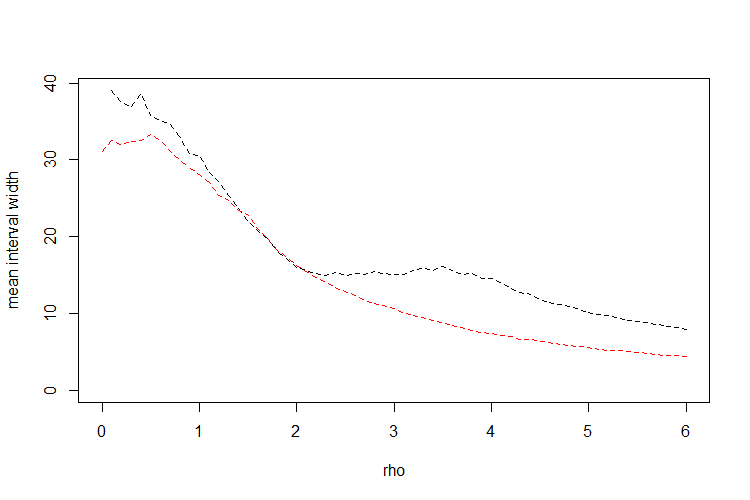
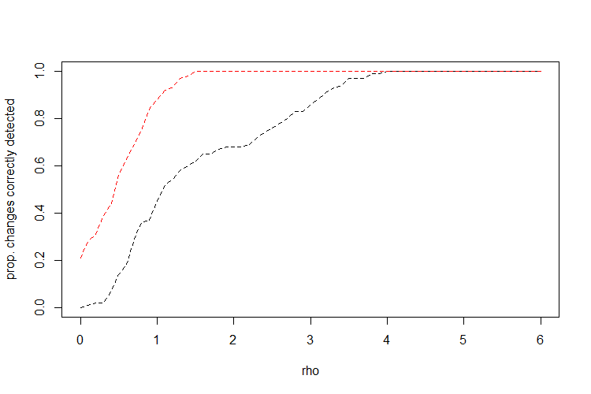

# NSP versus CUSUM detection intervals

Take n observations from a piecewise constant signal with a single break + centered and scaled Gaussian noise. Given a sub-interval I = [s,e] of [1,n] we may wish to test whether the particular interval contains the break. A popular choice is the CUSUM statistic. Another option is the multiscale test introduced in [Fryzlewicz (2020)](https://stats.lse.ac.uk/fryzlewicz/nsp/nsp.pdf).

Take all sub-intervals of [1,n]. This simulation investigates the average width of the *narrowest* interval on which the CUSUM and multiresolution tests will correctly detect the break. To control the FWER of the O(n^2) tests performed for the multiresolution test I use the results of [Kabluchko (2007)](https://arxiv.org/abs/0706.1849). The approximate p-values for the CUSUM statistic calculated at all scales and locations on a vector of pure noise are obtained by [Fang, Li, and Siegmund (2018)](https://arxiv.org/abs/1608.03032).

The simulation suggest that the interval width needed for detection by the CUSUM statistic will be uniformly smaller that required for detection with the multiresolution test.

---

#### Simulation plots

*Average length of intervals on which the changepoint was correctly detected, for signal of length n = 100 having energy (1+\rho) \sqrt{2 \log n} and each value is based on 100 Monte Carlo replications*

*what is not shown by the previous plot is that for low signal strength the CUSUM statistic is more powerful for detecting a change regardless of the length of the interval used. The next plot shows the proportion of tests which correclty detetced a changepoint across Monte Carlo replications for each signal strength:*

