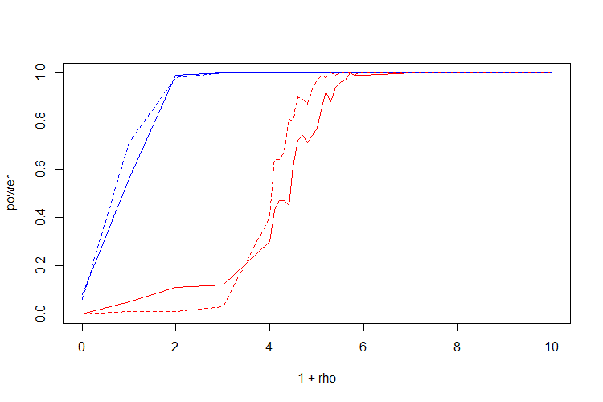

# NSP versus GLR test in the single changepoint setting

For the canonical changepoint detection problem - testing for a single changepoint given a signal contaminated by standard Gaussian noise -  [Verzelen et al. (2020)](https://arxiv.org/abs/2010.11470) show that there exists a phase transition in terms of the *energy* of the changepoint. When the energy is below the level \sqrt{2 \log\log n} no test of fixed size can consistently detect the jump. However, when the energy is above the level (1 + \rho) \sqrt{2 \log\log n} for some \rho > 0 several test have power tending to 1 for fixed size. One such test is the CUSUM test, derived from the generalized likelihood ratio statistic.

This simulation compares the power of the multiresolution procedure of [Fryzlewicz (2020)](https://stats.lse.ac.uk/fryzlewicz/nsp/nsp.pdf) designed for multiple changepoint inference with the CUSUM test which can be found for example in [Csörgö and Horváth (1997)](https://www.wiley.com/en-gb/Limit+Theorems+in+Change+Point+Analysis-p-9780471955221). The simulations show (as expected) that the CUSUM test has higher power than the multiresolution test. However, for large enough \rho the power of the multiresolution test still tends to 1 with the length of the signal being tested.

---

#### Plots from simulations

*\rho versus power for the CUSUM test (blue) and the multiresolution test (red) for sample sizes n = 100 (solid line) and n = 500 (dashed line):*

