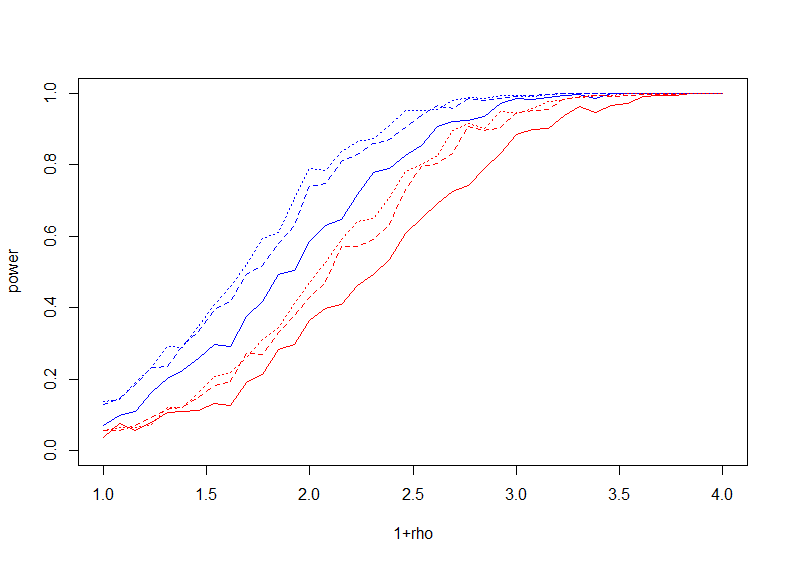

# Optimal changepoint detection in the single changepoint setting using a multiresolution test

Take a step function with zero or one jumps. Take n observations consisting of the step functions sampled at equidistant points + scaled and centered Gaussian noise. From these observations we may wish to test whether a jump is present in the step function.

[Verzelen et al. (2020)](https://arxiv.org/abs/2010.11470) show that there exists a phase transition in terms of the *energy* of the jump (changepoint) at level \sqrt{2 \log\log n}. When the energy is below this level no test of fixed size can consistently detect the jump. However, when the energy is above this level several test have power tending to 1 for fixed size. This is true of the CUSUM statistic using a particular threshold. In a separate note I showed this also to be true for a modification of the multiresolution test proposed by [Fryzlewicz (2020)](https://stats.lse.ac.uk/fryzlewicz/nsp/nsp.pdf), where the threshold is chosen using the results of [Darling and Erdös (1956)](https://projecteuclid.org/journals/duke-mathematical-journal/volume-23/issue-1/A-limit-theorem-for-the-maximum-of-normalized-sums-of/10.1215/S0012-7094-56-02313-4.short). This simulation compares empirically the power of the CUSUM and modified multiresolution tests for different signal strengths.

The simulation shows both tests have power tending to one (as expected), but the CUSUM test appears to have uniformly higher power.

---

#### Plots from simulations

*\rho versus power for the CUSUM test (blue) and the multiresolution test (red) for sample sizes n = 100 (solid line), n = 500 (dashed line), and n = 1000 (dotted line)*

